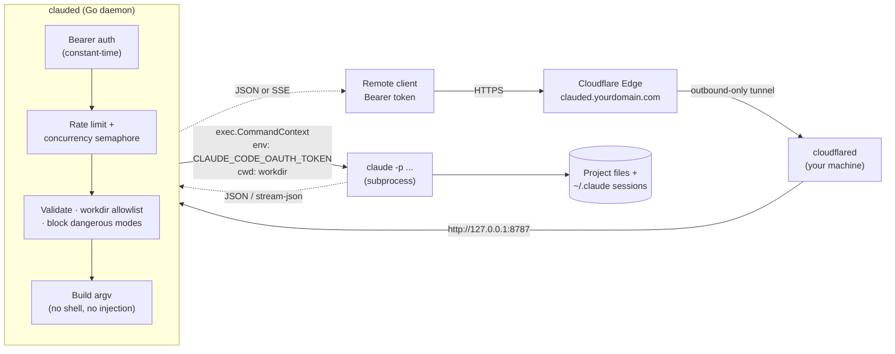
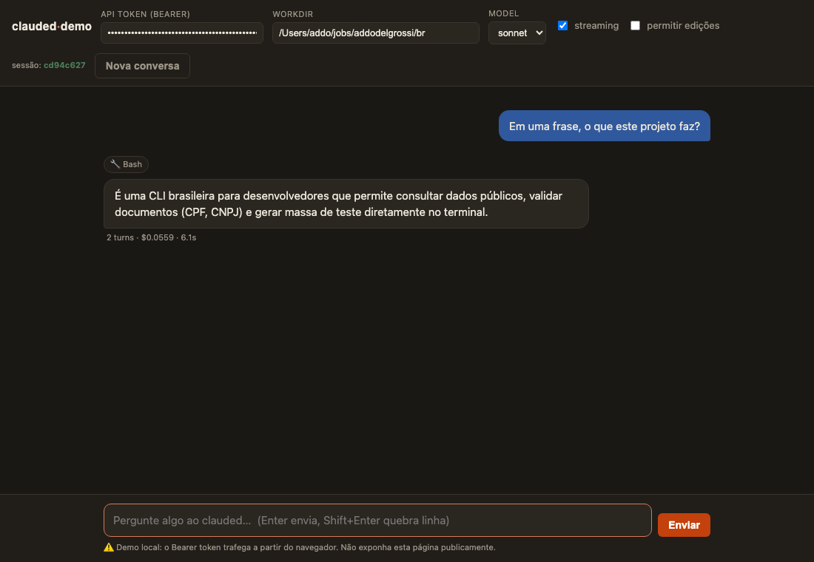

# clauded

**English** · [Português](README.pt-BR.md)

> **An HTTP API over headless Claude Code, powered by your Pro/Max subscription.**

[](https://github.com/addodelgrossi/clauded/actions/workflows/release.yml)
[](https://pkg.go.dev/github.com/addodelgrossi/clauded)
[](https://goreportcard.com/report/github.com/addodelgrossi/clauded)
[](LICENSE)

`clauded` is a Go HTTP daemon (Unix naming convention: *Claude + d*, like
`sshd`/`dockerd`) that wraps **Claude Code in headless mode** (`claude -p`) and
exposes it as a **REST/streaming API**. It runs on your machine, executes agentic
prompts against local projects, and returns the result as JSON or Server-Sent
Events.

The key point: `clauded` authenticates Claude Code with **your subscription's
OAuth token** (`CLAUDE_CODE_OAUTH_TOKEN`), **not** the per-token paid
`ANTHROPIC_API_KEY` — so you use the quota you already pay for. For remote access
it sits behind a **Cloudflare Tunnel** (outbound-only connection, no firewall
ports opened), protected by a Bearer token.

---

## ⚠️ Security warning

**This service runs commands and edits files on your machine.** Treat it as
privileged access:

- **Protect the tokens.** `CLAUDED_API_TOKEN` and `CLAUDE_CODE_OAUTH_TOKEN` grant
  access to the service and to your subscription. Never commit them, never leak
  them in logs. `clauded` never logs these values.
- **Use the directory allowlist.** Set `CLAUDED_ALLOWED_ROOTS` to restrict which
  folders a client can read/edit. Paths outside them (after resolving symlinks
  and `..`) are rejected with `403`.
- **Dangerous permission modes are blocked by default.** `bypassPermissions` and
  `dontAsk` only work with `CLAUDED_ALLOW_DANGEROUS=true`.
- **Bind to `127.0.0.1`.** External access should only come through the
  Cloudflare Tunnel. Never expose the port directly to the internet.

---

## How it works



A `POST /v1/runs` request is authenticated, validated, acquires a slot in the
concurrency semaphore, is translated into the `claude` `argv` (no shell, no
injection), executed with the correct `cwd` and env, and the output is returned
as a single JSON object or an SSE stream.

---

## Installation

### One-liner installer (recommended)

Downloads and installs the binary from the **latest release** automatically
(macOS/Linux, detects OS and architecture):

```bash
curl -fsSL https://raw.githubusercontent.com/addodelgrossi/clauded/main/scripts/install.sh | sh
```

By default it installs to `~/.local/bin` (or `/usr/local/bin`). To pick the
version or directory:

```bash
curl -fsSL https://raw.githubusercontent.com/addodelgrossi/clauded/main/scripts/install.sh \
  | CLAUDED_VERSION=v0.1.0 CLAUDED_INSTALL_DIR=/usr/local/bin sh
```

> The variables go **after** the pipe (before `sh`), because they need to reach
> the script — not `curl`.

### Manual download

Grab the archive from the [latest release](https://github.com/addodelgrossi/clauded/releases/latest)
for your platform — `darwin_arm64`, `darwin_amd64`, `linux_amd64`, `linux_arm64`
(`.tar.gz`) or `windows_amd64` (`.zip`) — extract it and move `clauded` to your
`PATH`:

```bash
tar -xzf clauded_*_darwin_arm64.tar.gz
install clauded ~/.local/bin/
```

Verify integrity with the `checksums.txt` attached to the release.

### Via `go install`

```bash
go install github.com/addodelgrossi/clauded/cmd/clauded@latest
```

### Building from source

```bash
git clone https://github.com/addodelgrossi/clauded
cd clauded
make build      # produces dist/clauded
```

---

## Prerequisites

1. **Claude Code installed** and on your `PATH` (`claude --version`).
2. **The subscription OAuth token.** Generate it with:

   ```bash
   claude setup-token
   export CLAUDE_CODE_OAUTH_TOKEN="<generated token>"
   ```

   This uses your Pro/Max subscription quota instead of billing per token.
3. **A Bearer token for the API** (any strong secret string):

   ```bash
   export CLAUDED_API_TOKEN="$(openssl rand -hex 32)"
   ```

---

## Configuration

Precedence (highest → lowest): **command-line flag → environment variable
`CLAUDED_*` → YAML file (`--config`) → default**.

| Env | Flag | Default | Description |
|---|---|---|---|
| `CLAUDED_ADDR` | `--addr` | `127.0.0.1:8787` | Server bind address |
| `CLAUDED_API_TOKEN` | — | (required) | API Bearer token |
| `CLAUDE_CODE_OAUTH_TOKEN` | — | (required¹) | Subscription token (`claude setup-token`) |
| `ANTHROPIC_API_KEY` | — | — | Paid alternative; required for `bare:true` |
| `CLAUDED_ALLOWED_ROOTS` | `--allowed-roots` | `$HOME/projects` | Allowed roots for `workdir` |
| `CLAUDED_MAX_CONCURRENCY` | `--max-concurrency` | `2` | Concurrent runs |
| `CLAUDED_DEFAULT_MODEL` | `--default-model` | `sonnet` | Default model |
| `CLAUDED_CLAUDE_BIN` | `--claude-bin` | `claude` | Path to the claude binary |
| `CLAUDED_RUN_TIMEOUT` | `--run-timeout` | `10m` | Per-run timeout |
| `CLAUDED_ALLOW_DANGEROUS` | — | `false` | Enables `bypassPermissions`/`dontAsk` |
| `CLAUDED_LOG_FORMAT` | `--log-format` | `json` | `json` or `text` |
| `CLAUDED_LOG_LEVEL` | `--log-level` | `info` | `debug`/`info`/`warn`/`error` |
| `CLAUDED_SESSION_STORE` | `--session-store` | `$HOME/.clauded/sessions.json` | Session store |
| `CLAUDED_RATE_LIMIT_PER_MINUTE` | `--rate-limit-per-minute` | `60` | Requests/client/min (0=unlimited) |
| `CLAUDED_METRICS_ENABLED` | `--metrics` | `false` | Exposes `/metrics` |
| `CLAUDED_CONFIG` | `--config` | — | Path to the YAML file |

¹ You must provide `CLAUDE_CODE_OAUTH_TOKEN` **or** `ANTHROPIC_API_KEY`.

See [`clauded.example.yaml`](clauded.example.yaml) for a commented file.

Starting the service:

```bash
export CLAUDED_API_TOKEN="..."
export CLAUDE_CODE_OAUTH_TOKEN="..."
clauded --allowed-roots "$HOME/projects" --log-format text
# → INFO clauded started addr=127.0.0.1:8787 ...
```

---

## Usage

Every endpoint (except `/healthz`) requires `Authorization: Bearer $CLAUDED_API_TOKEN`.

```bash
# Simple run (JSON)
curl -sS https://clauded.yourdomain.com/v1/runs \
  -H "Authorization: Bearer $CLAUDED_API_TOKEN" \
  -H "Content-Type: application/json" \
  -d '{"prompt":"Refactor the auth package to use JWT","workdir":"/Users/me/projects/api","model":"sonnet"}'

# Streaming (SSE)
curl -N https://clauded.yourdomain.com/v1/runs \
  -H "Authorization: Bearer $CLAUDED_API_TOKEN" \
  -H "Content-Type: application/json" \
  -d '{"prompt":"Explain the architecture","workdir":"/Users/me/projects/api","stream":true}'

# Resume a session (same workdir!)
curl -sS https://clauded.yourdomain.com/v1/runs \
  -H "Authorization: Bearer $CLAUDED_API_TOKEN" \
  -d '{"prompt":"Now implement what you suggested","resume":"<session-id>","workdir":"/Users/me/projects/api"}'

# Invoke a SKILL explicitly (slash command in the prompt)
curl -sS https://clauded.yourdomain.com/v1/runs \
  -H "Authorization: Bearer $CLAUDED_API_TOKEN" \
  -d '{"prompt":"/security-review","workdir":"/Users/me/projects/api","permission_mode":"acceptEdits"}'

# Invoke a SKILL via natural language (the model picks the matching skill)
curl -sS https://clauded.yourdomain.com/v1/runs \
  -H "Authorization: Bearer $CLAUDED_API_TOKEN" \
  -d '{"prompt":"generate a PDF report from this project README","workdir":"/Users/me/projects/api","tools":"Read,Bash,Write"}'

# List sessions
curl -sS https://clauded.yourdomain.com/v1/sessions \
  -H "Authorization: Bearer $CLAUDED_API_TOKEN"
```

### Sessions: resume, continue, fork

Claude Code stores history in
`~/.claude/projects/<encoded-workdir>/<session-id>.jsonl`. **Resuming only works
with the same `workdir`** — `clauded` ties each `session_id` to its `workdir` in
the store and reuses it automatically (you can even omit `workdir` on a `resume`
of a known session).

- `resume`: resumes a specific session (recommended for the API).
- `continue`: resumes the most recent session for that `workdir`.
- `fork`: creates a new session from the history, without altering the original.

If a run stops due to a limit (`subtype: error_max_turns` or
`error_max_budget_usd`), the `session_id` is returned so you can resume with a
higher limit.

### Skills and slash commands

Skills work in two ways: explicitly (`"prompt": "/security-review"`) or via
natural language (the model picks the skill whose `description` matches). The
skill must be **installed on the machine** where `claude` runs. Interactive
commands (`/login`, `/config`) do not work in headless mode. Skills that use
tools depend on `permission_mode`/`tools`.

---

## Web UI (demo)

A tiny, dependency-free chat page is **embedded in the binary** and served at
[`/ui`](http://127.0.0.1:8787/ui) (no auth on the page itself). It's meant to
**show off and poke at** `clauded` interactively — streaming responses, session
continuity, cost/turn metrics — without writing any client code.

```bash
clauded --allowed-roots "$HOME/projects"
# open http://127.0.0.1:8787/ui , paste your CLAUDED_API_TOKEN, pick a workdir, chat
```



- **Streaming toggle** — live token-by-token output (SSE) or single request/response.
- **Conversation continuity** — keeps the `session_id` and `resume`s it on follow-ups.
- **Allow edits** — sends `permission_mode: acceptEdits` so the agent can write files.
- Tool calls show up as chips (e.g. `🔧 Bash`); each answer shows turns · cost · duration.

> ⚠️ **Local demo only.** The page sends your `CLAUDED_API_TOKEN` straight from
> the browser. Don't expose `/ui` publicly — keep it behind localhost (or your
> tunnel's access controls). It exists to demonstrate the API, not as a product UI.

---

## API reference

Full specification in [`api/openapi.yaml`](api/openapi.yaml) (OpenAPI 3.1).

**Endpoints:** `POST /v1/runs`, `GET /v1/sessions`, `GET /v1/sessions/{id}`,
`GET /healthz` (public), `GET /readyz`, `GET /version`.

Main fields of the `POST /v1/runs` body (mapped to `claude -p` flags):

| Field | Flag | Notes |
|---|---|---|
| `prompt` *(required)* | `-p` | May start with `/<skill>` |
| `workdir` | `--add-dir` + `cwd` | Must be inside the allowlist |
| `model` | `--model` | `sonnet`/`opus`/`haiku`/`fable` or ID |
| `session_id` | `--session-id` | UUID v4 (generated if absent) |
| `resume` | `--resume` | UUID of an existing session |
| `continue` | `--continue` | Most recent session for the workdir |
| `fork` | `--fork-session` | New ID when resuming |
| `output_format` | `--output-format` | `text`/`json`/`stream-json` |
| `stream` | (SSE) | Forces `stream-json` |
| `permission_mode` | `--permission-mode` | `default`/`acceptEdits`/`plan`/`auto`/`dontAsk`²/`bypassPermissions`² |
| `tools` | `--tools` | E.g. `"Bash,Edit,Read"` |
| `max_turns` | `--max-turns` | See compatibility note below |
| `max_budget_usd` | `--max-budget-usd` | Spending ceiling |
| `append_system_prompt` / `system_prompt` | same | |
| `mcp_config` / `strict_mcp_config` | same | |
| `agents` / `json_schema` | same | |
| `effort` | `--effort` | `low`/`medium`/`high`/`xhigh` |
| `fallback_model` | `--fallback-model` | |
| `setting_sources` | `--setting-sources` | E.g. `"user,project,local"` |
| `plugin_dirs` / `plugin_urls` | `--plugin-dir`/`--plugin-url` | `plugin_dirs` validated against the allowlist |
| `bare` | `--bare` | ⚠️ See note below |

² Require `CLAUDED_ALLOW_DANGEROUS=true`, otherwise `403`.

> **Note on `bare`.** The `--bare` flag disables reading OAuth credentials and
> the keychain — in that mode Claude Code only authenticates with
> `ANTHROPIC_API_KEY`. So `bare:true` is **incompatible with the subscription**
> and `clauded` rejects it with `400` unless `ANTHROPIC_API_KEY` is configured.

> **Note on `max_turns`.** The `--max-turns` flag may not exist in every version
> of the `claude` CLI. `clauded` sends it when you specify it; if your version
> doesn't recognize it, the run fails with a CLI error. Verify with the
> integration test (`make test-integration`).

---

## Remote access via Cloudflare Tunnel

Cloudflare Tunnel makes an **outbound-only** connection to Cloudflare's edge — it
doesn't require opening ports on your firewall/router, and Cloudflare provides
TLS on your subdomain. Requires a domain managed by Cloudflare.

```bash
# 1. Install cloudflared
./scripts/install-cloudflared.sh

# 2. Authenticate against your account
cloudflared tunnel login

# 3. Create the tunnel (generates credentials + Tunnel ID)
cloudflared tunnel create clauded

# 4. Route a hostname
cloudflared tunnel route dns clauded clauded.yourdomain.com

# 5. Configure (see deploy/cloudflared-config.yml)
cp deploy/cloudflared-config.yml ~/.cloudflared/config.yml
# edit <TUNNEL_ID> and the credentials path

# 6. Run
cloudflared tunnel run clauded
```

**Defense in depth:** even with the tunnel, keep the Bearer token and, ideally,
enable **Cloudflare Access** (identity policies at the edge) in front of the
hostname as a second authentication layer.

### Quick alternative (prototype): ngrok

```bash
ngrok http 8787
```

Simpler and ephemeral, but **less secure** (random public URL). The Bearer token
remains mandatory.

---

## Running as a service

### Linux (systemd)

```bash
cp deploy/clauded.service ~/.config/systemd/user/
# create ~/.config/clauded.env (chmod 600) with the secrets and ~/.config/clauded.yaml
systemctl --user daemon-reload
systemctl --user enable --now clauded
loginctl enable-linger "$USER"   # keeps it running after logout
```

### macOS (launchd)

```bash
cp deploy/com.user.clauded.plist ~/Library/LaunchAgents/
# edit the absolute paths and tokens in the file
launchctl load -w ~/Library/LaunchAgents/com.user.clauded.plist
```

See the comments in each file under `deploy/` for details and hardening.

---

## Development

```bash
make build              # builds dist/clauded
make test               # unit tests (-race -cover)
make test-integration   # invokes the real claude (requires token)
make lint               # golangci-lint
make cross              # cross-compiles the 5 targets manually
make release            # goreleaser (on a tag)
```

Repository layout:

```
cmd/clauded/        # main: flags, wire-up, graceful shutdown
internal/config/    # 3-layer config
internal/runner/    # RunRequest -> argv translation, exec, parse
internal/server/    # mux, handlers, middlewares, SSE
internal/session/   # JSON store session_id -> workdir
internal/version/   # version injected via -ldflags
api/openapi.yaml    # API spec
deploy/             # systemd, launchd, cloudflared
```

The `RunRequest → argv` translation (`internal/runner/options.go`) is a pure
function covered by table tests; the executor is abstracted behind an interface
with a fake so it can be tested without the real binary.

---

## FAQ / Troubleshooting

**`resume` came back with an empty session / no context.** The `workdir` must be
the **same** as when the session was created — Claude Code's history is indexed
by `cwd`. `clauded` handles this through the store, but if you passed a different
`workdir` than the original, it'll be a new session.

**`401 Unauthorized`.** The `Authorization: Bearer <token>` header is missing or
the token doesn't match `CLAUDED_API_TOKEN`.

**`403 workdir_forbidden`.** The `workdir` is outside `CLAUDED_ALLOWED_ROOTS`.
Adjust the allowed roots.

**`readyz` returns 503 / "claude not found".** The `claude` binary isn't on the
`clauded` process's `PATH`. Set `CLAUDED_CLAUDE_BIN` to the absolute path or
adjust the service's `PATH`.

**`bare_requires_api_key`.** You passed `bare:true` without `ANTHROPIC_API_KEY` —
see the note on `bare` above.

**A run fails with an error mentioning `--max-turns`.** Your `claude` version may
not support that flag; remove `max_turns` from the request.

---

## License

[MIT](LICENSE) © 2026 Addo Del Grossi.
